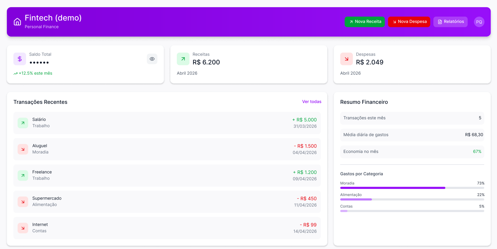

# Fintech Dashboard — FIAP

## Demonstração

Acesse a versão publicada do projeto:

https://paulopontodev.github.io/fintech-fiap/

Projeto desenvolvido para o desafio de criação de uma tela do projeto **Fintech**, utilizando **HTML**, **CSS separado** e **Tailwind CSS**.

A proposta desta tela é apresentar um painel financeiro moderno, responsivo e visualmente coerente, com indicadores de saldo, receitas, despesas, transações recentes, meta de economia e resumo de gastos por categoria.

## Preview da tela de protótipo



## Objetivo da atividade

Recriar uma tela relacionada ao projeto Fintech, respeitando os critérios de avaliação:

- Tela relacionada ao contexto de uma Fintech;
- HTML e CSS em arquivos separados;
- Uso de Tailwind CSS para layout e estilização;
- Responsividade para dispositivos mobile;
- Projeto funcional ao abrir o arquivo `index.html`;
- Repositório público no GitHub contendo todos os arquivos necessários.

## Evolução visual aplicada

O layout foi redesenhado com uma linguagem mais moderna de fintech, mantendo a base da tela original. Foram aplicados:

- Cards com bordas arredondadas e efeito glassmorphism;
- Fundo com gradientes suaves e textura visual discreta;
- Card principal para saldo e fluxo financeiro mensal;
- Indicador circular de meta do mês;
- Cards de receitas, despesas e saúde financeira;
- Lista de transações com melhor hierarquia visual;
- Resumo financeiro com barras de progresso por categoria;
- Responsividade para desktop, tablet e mobile.

## Tecnologias utilizadas

- HTML5;
- CSS3;
- Tailwind CSS via CDN;
- SVGs inline para ícones, evitando dependência de bibliotecas externas de ícones;
- Layout responsivo com grid, flexbox, media queries e alguns utilitários do Tailwind.

## Estrutura do projeto

```txt
fintech-fiap/
├── index.html
├── styles.css
├── README.md
└── src/
    └── tela-referencia.png
```

## Como executar

1. Baixe ou clone este repositório.
2. Abra o arquivo `index.html` diretamente no navegador.
3. Não é necessário instalar dependências nem executar servidor local.

## Observações sobre o Tailwind CSS

O projeto utiliza o Tailwind CSS via CDN para facilitar a abertura direta do arquivo HTML na máquina do avaliador. O CSS autoral fica no arquivo `styles.css`, deixando o HTML mais limpo sem deixar de cumprir o requisito de uso do Tailwind.

## Responsividade

A tela foi construída para se adaptar a diferentes tamanhos de tela:

- Em desktop, o dashboard usa áreas em grid para separar resumo, indicadores, transações e relatórios;
- Em tablets, os blocos principais passam a ocupar uma coluna única quando necessário;
- Em celulares, cards, botões e listas são empilhados com espaçamentos ajustados para leitura;
- A interface mantém contraste, hierarquia e usabilidade em telas menores.

## Autor
Paulo Roberto de Queiroz Junior.<br>
Projeto acadêmico desenvolvido para a FIAP.

